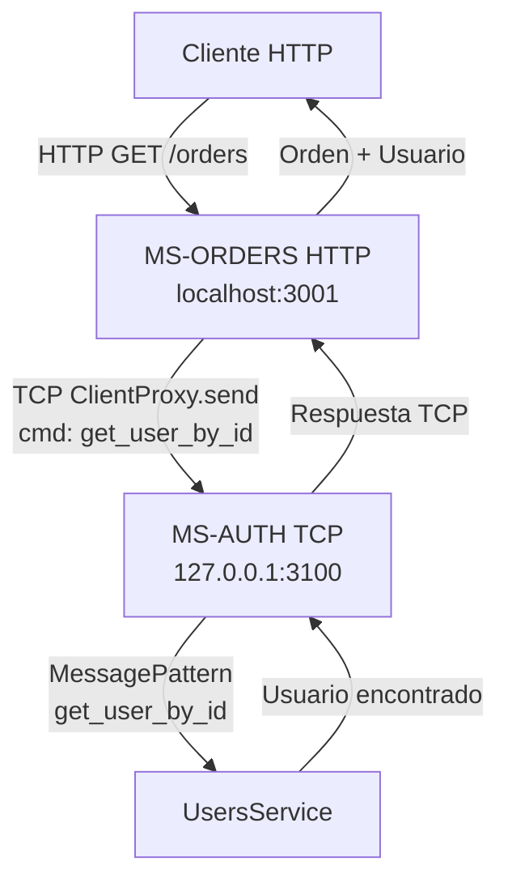
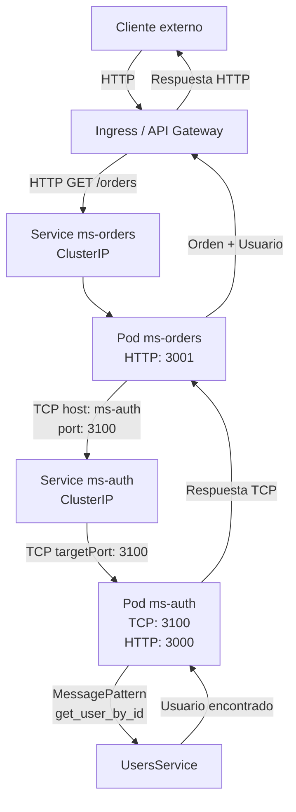

# POC NestJS Microservices TCP

## Descripción

Prueba de concepto (POC) para demostrar la comunicación entre microservicios utilizando el transporte TCP nativo de NestJS, sin necesidad de utilizar protocolos HTTP internos ni brokers de mensajería como RabbitMQ, Kafka o NATS.

## Objetivo

Validar el mecanismo de comunicación síncrona entre microservicios utilizando:

- Transport.TCP
- ClientProxy
- @MessagePattern
- ClientProxy.send()
- firstValueFrom()

Además, evaluar una arquitectura compatible con despliegues futuros en Kubernetes.

## Microservicios

La solución está compuesta por dos microservicios:

### MS-AUTH

Microservicio responsable de la gestión de usuarios.

#### Funciones principales:

- Exponer endpoints HTTP para consulta de usuarios.
- Exponer handlers TCP mediante @MessagePattern().
- Responder solicitudes provenientes de otros microservicios.

### MS-ORDERS

Microservicio responsable de la gestión de órdenes.

#### Funciones principales:

- Exponer endpoints HTTP para consulta de órdenes.
- Almacenar únicamente el identificador del usuario (userId).
- Consultar información del usuario al microservicio MS-AUTH mediante TCP.

## Arquitectura General

### Diagrama Flujo en Entorno Local



### Diagrama Flujo en Kubernets



## Consideraciones para Kubernets

### No utilizar IPs de Pods

Los Pods son efímeros y sus direcciones IP pueden cambiar debido a:

- Reinicios
- Reprogramación de Pods
- Escalamiento horizontal
- Actualizaciones de despliegue

Por esta razón, los microservicios nunca deben comunicarse utilizando direcciones IP de Pods.

#### Incorrecto:

```text
host: '10.244.0.15';
```

#### Correcto:

```text
host: 'ms-auth';
```

### Utilizar Services

Kubernetes proporciona una dirección estable mediante objetos Service.

#### Ejemplo:

```yaml
apiVersion: v1
kind: Service
metadata:
  name: ms-auth
spec:
  type: ClusterIP
  selector:
    app: ms-auth
  ports:
    - name: http
      protocol: TCP
      port: 3000
      targetPort: 3000
    - name: tcp
      protocol: TCP
      port: 3100
      targetPort: 3100
```

### Escalabilidad

Al utilizar un Service:

```text
ms-auth
```

Kubernetes distribuirá automáticamente las solicitudes TCP entre múltiples Pods disponibles.

Ejemplo:

```text
Service ms-auth
       │
       ├── Pod ms-auth-1
       ├── Pod ms-auth-2
       └── Pod ms-auth-3
```

Esto permite escalar horizontalmente sin realizar cambios en el código fuente.

## Ventajas de la Solución

- Comunicación nativa de NestJS.
- Sin dependencias externas de mensajería.
- Menor complejidad para escenarios simples.
- Compatible con Kubernetes.
- Fácil migración futura a RabbitMQ, Kafka o NATS.
- Tipado fuerte mediante DTOs compartidos.
- Menor latencia que llamadas HTTP internas.

## Tecnologías Utilizadas

- NestJS
- TypeScript
- TCP Transport
- RxJS
- Docker
- Kubernetes
- Ingress Controller
- ClusterIP Services

## Conclusión

Esta prueba de concepto valida que NestJS permite implementar una arquitectura de microservicios utilizando TCP nativo para comunicación interna entre servicios.

La solución mantiene separación de responsabilidades entre dominios, evita dependencias HTTP internas y se encuentra preparada para ser desplegada en entornos Kubernetes mediante Services y DNS internos del clúster.
